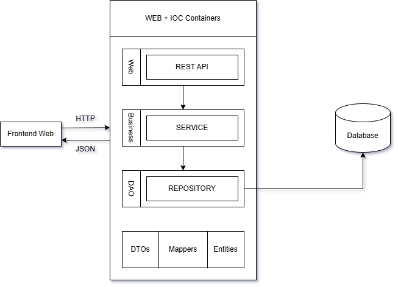
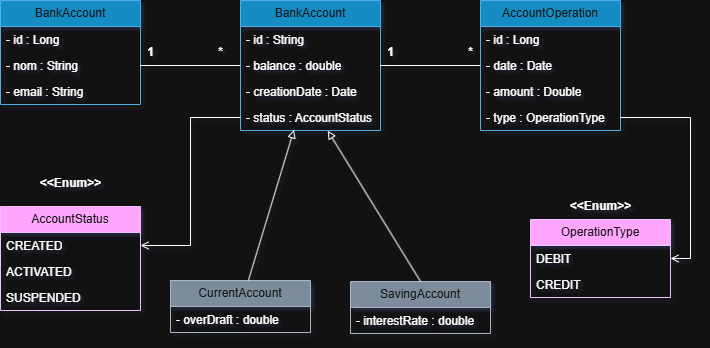

# Digital Bank Springboot Application | Backend

## Project Description
This application is a replica of a virtual bank application that shows the different operations that could be done in a digital bank such as CRUD of the customers and their accounts. It is build with Springboot, a framework that is designed to simplify the development of Java-based applications, offering RESTful services and interacts with relational databases for persistent storage.

## Technologies Used
- Java :
- Springboot:
- Spring Data JPA:
- MySQL:
- Maven:
- For the frontend part, we used Angular (https://github.com/mohamed-ameziane/Digital-Bank-Frontend)

## Architecture
The application type is monolithic...
### 1-Application Architecture


### 2- Application Layers
- Controller Layer (REST APIs)
- Service Layer (Business Logic)
- Repository Layer (Data Access)
- Madel Layer (Entities)

### 3- Database Schema


## Features and Functionalities

### CRUD Operations

The application provides complete CRUD (Create, Read, Update, Delete) functionalities for managing customer and account data through RESTful web services.

**Customer Operations:**

* **Create:** Add a new customer via `POST /customers`.
* **Read:**
  * Get all customers: `GET /customers`
  * Get customer by ID: `GET /customers/{id}`
  * Search customers (with filtering): `GET /customers/search`
* **Update:** Modify an existing customer using `PUT /customers/{customerId}`.
* **Delete:** Remove a customer via `DELETE /customers/{id}`.

### Business Logic

The business layer encapsulates the core logic for handling banking operations. It ensures:

* **Data integrity** when updating or deleting customer and account information.
* **Validation** of account operations such as transfers, debits, and credits.
* **Consistency** in transaction history and account balances.
* **Exception handling** for operations on non-existent accounts or insufficient funds.

### API Endpoints

Below are the available API endpoints grouped by controller:

#### Customer REST Controller (`customer-rest-controller`)

| Method   | Endpoint                  | Description                     |
| -------- | ------------------------- | ------------------------------- |
| `GET`    | `/customers`              | Retrieve all customers          |
| `GET`    | `/customers/{id}`         | Get customer details by ID      |
| `POST`   | `/customers`              | Add a new customer              |
| `PUT`    | `/customers/{customerId}` | Update customer information     |
| `DELETE` | `/customers/{id}`         | Delete a customer               |
| `GET`    | `/customers/search`       | Search for customers by keyword |

#### Bank Account REST Controller (`bank-account-rest-controller`)

| Method | Endpoint                               | Description                                |
| ------ | -------------------------------------- | ------------------------------------------ |
| `POST` | `/accounts/transfer`                   | Perform a fund transfer between accounts   |
| `POST` | `/accounts/debit`                      | Debit an account                           |
| `POST` | `/accounts/credit`                     | Credit an account                          |
| `GET`  | `/accounts`                            | List all bank accounts                     |
| `GET`  | `/accounts/{accountId}`                | Get account details by ID                  |
| `GET`  | `/accounts/{accountId}/pageOperations` | Get paginated list of operations (history) |

These APIs allow external systems to interact with the application’s backend for account management, customer services, and financial operations.

### 4- Configuration
The configuration of this application is found on the file `application.properties` containing :
- Application Name: Sets the application name to Digital_Banking.
- Server Port: The application runs on port 8082.
- Database Configuration:
- Connects to a MySQL database E-BANK.
- Auto-creates the database if it does not exist.
- Uses root as the username and no password (for local development).
- JPA is configured to update the schema automatically.
- Uses MariaDB dialect for Hibernate.

### 5- How to Run?
Make sure to have Java 17+ installed, and MySQL server running on localhost (port 3306).

1- Clone the repository:

```
git clone [<repository-url>](https://github.com/mohamed-ameziane/Digital-Bank)
cd <project-directory>
```
2- Build the project:

`mvn clean install`

3- Run the application:

`mvn spring-boot:run`

4- Access the application:

API Documentation (Swagger UI): < http://localhost:8082/swagger-ui.html >. REST endpoints can be tested using Postman or Swagger.

### 6- Simulation
Here are some screenshots of the simulation of this application:
#### 1. Customers

#### 2. Customer By ID

#### 3. Search Customer By Keyword


